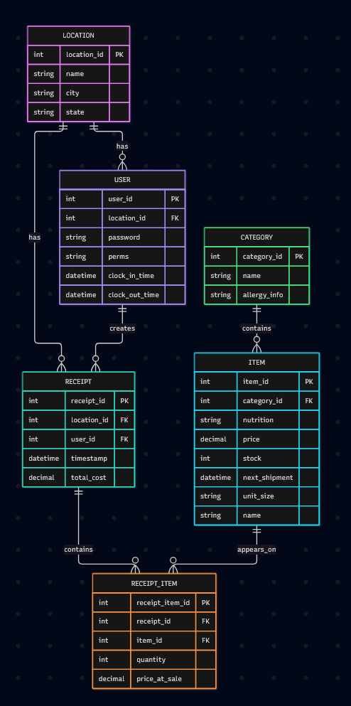

# CSCE 331 Project 2 - Team 1

## Team Members and Roles

| Team Member    | Role                           |
| -------------- | ------------------------------ |
| Ashley Hoang   | Front-End Developer Lead       |
| Sharaf Mehmood | Front-End Developer Lead       |
| Pablo Almanza  | Back-End Developer Lead        |
| Colby Ideker   | Back-End Developer Lead        |
| Samuel Just    | Project Manager / Integrations |

## Design Diagram

## Design Schema
Location: Location is important for understanding what specific panda express the data pertains to, to analyze the logisitcs of it and if its performing well.  
User: User logins are important to tell what information needs to be displayed; if it's for a cashier, they need the relevant information to perform orders, but if it's for a manager, they need the relevant information for reports and such.  
Receipts: Receipts are very important for tracking the order history for the manager, especially to generate end of day reports on profits.
Receipt Item: Receipt item is a way to separate the receipt for order history and to manage stock.  
Category: Category helps separate all of the different item types to help organize the views for cashiers, to make it easier to place orders.  
Item: Item is there for the specifics of the items that may appear on receipts, for price, stock, and other important information the manager and cashier may need to know to make sure the restauraunt is operating correctly.  

## AI Usage

### Diagram

After making initial diagram, I asked the ai to give feedback on what didn't make sense.
It helped refactor the Receipts so that they properly used multiple items. 
I then asked it to take the BaseDesign.erd (human made) and make a FoormattedDesign (ai made).

[See the full chat here](https://chat.tamu.ai/s/32874c32-d403-44a1-bdb2-31b5342cb6c6)
